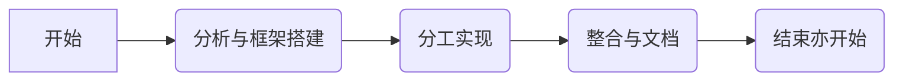

# 爱食堂 学科实践微信小程序

## by blank space

### 问题背景

> 萌生做这样一个小程序的原因很朴素，学校食堂的人实在是太多了

1. 食堂窗口选择高效。我们在食堂用餐的时候，面对多个窗口，我们会面临不知道有什么菜品，以及不知道自己喜欢的菜品在什么窗口，怎么才能吃到的问题，绝大多数同学都是轮到自己打菜时面临没有自己喜欢吃的菜而只能随便点菜。我们小程序准备通过展示出每天的菜谱而让同学们了解自己喜欢的菜在哪个窗口，以便于同学更好地选择窗口进行排队。
2. 对于学校增快速取餐窗口的一点体验优化。同学们可以快速取餐，虽然这样提高了效率，但是往往面临菜品单一而没有选择的余地。我们希望通过让同学们留言自己最喜欢以及最想吃的菜品，后勤部门可以根据喜爱程度来决定当日快速窗口的菜单，也就更加人性化的服务师生。
3. 反馈调整机制。很多时候我们在用餐时会对当日的菜品或者食堂中的某一部分有一些建议，以及希望食堂增加的菜品。所以我们设置了留言讨论和反馈吐槽的窗口，能让食堂的工作人员对根据大家的建议，看能否做出一些小小的改变。

### 项目准备

> 这学期时间也太紧张了吧 小小吐槽一下

1. 预备知识 html CSS JavaScript
2. 应用知识 vue uniapp 微信开发者工具
3. 有点陌生的知识 ~~云开发~~ ~~数据库~~ ~~(划掉)~~
4. 一点想法 在我们小队看来，这次任务的重心应该是放在前端的各种方面，主要任务在于搭建框架、合理布局以及美化可视化界面，所以我们将主要重心放在了前端上

### 布局与逻辑

> 做前端没有美术功底真的伤不起 

1. 首页：美食轮播、吐槽接口、开发进度展示、督促自我
2. 每日推荐：快速套餐预定或购买、窗口美食推荐、留言讨论
3. 个人中心：信息登录、获取并展示用户信息、便于管理
4. 留言板：留言讨论功能、删除、评论功能待做
5. 吐槽飞信：可以写字留言、拍照、实时反馈建议

### 开发流程

> 小项目的结束 大项目的开始

### 技巧和方法

> 三分课上课学 九十七分下课学

1. `tabbar`在底部设置三个不同界面，执行跳转页面的功能
2. 模态弹窗在快速取餐套餐的实现
3. `navigator`实现页面的跳转以及返回
4. 用函数实现简易留言版的功能
5. 使用微信小程序表单组件，例如有`picker-view`[^1]实现吐槽时的各种选择功能，此处实现了各种表单的操作，可能对于实验本身时冗余的，但对于表单知识的掌握是有利的
6. 用`wx.chooseImage()`实现本地图片的选择以及上传
7. ColorUi[^2]类的引入的引入 方便CSS的处理 对整体风格做了优化与提升
8. 对轮播图进行了优化并实现了两个页面不同风格的对比
9. 开发进度展示 使用了进度条的动态效果和条纹

### 实现效果

> 想法有多美好 实现中就有多烦恼

在整个小程序中设置三个界面，主页，推荐和个人中心。

主页运用轮播图显示了一些好吃的菜品，同时设置了留言的两个留言按钮板块，一个实现对菜品的点赞，另一个则实现对没那么满意的菜品建议。点击两个按钮则分别进入两个不同的留言页面。可以分别进行留言建议。

关于为什么将开发的一些信息放在主页，一来我们认为这是我们的小练手，而**暂时**没有发行出来投入使用的想法，所以放在主页方便查看，二来是对自己的一个督促，督促自己推动进度前进，督促自己不断学习。

推荐页面则可以对当日快速窗口中的套餐进行预定查看，以及我们可以看见每个窗口的推荐菜品，供大家查看以方便大家根据自己喜欢的菜品选择自己排队的窗口。同时，在页面的最底部设置了一个对快速窗口菜品的留言窗口，进入留言界面可以留言自己希望快速取餐套餐中出现的菜品，从而让大家可以吃到自己更加喜欢的菜品。

个人中心可以实现登录，从而在已知身份的情况下，实名提出建议。鉴于后端技术原因，只完成了获取当前登录用户的信息的实现，信息可以提取出来，但还没有接受管理。

### 队伍分工

> blankspace 鹅鹅鹅 
keep a secret
### 联系

个人主页 [github.com/peace-dove](github.com/peace-dove)

[^1]: 嵌入页面的滚动选择器
[^2]: 鲜亮的高饱和色彩 注重视觉的组件库
